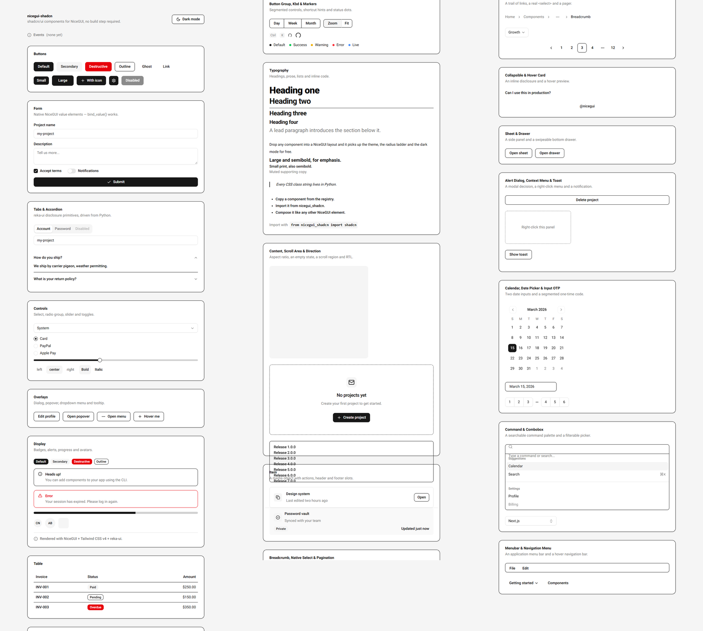
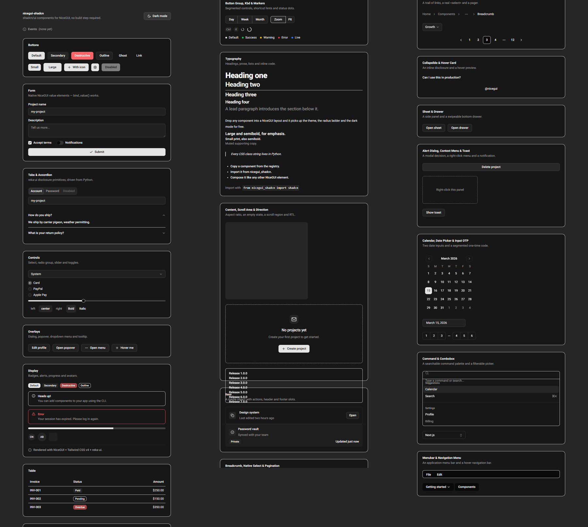

# nicegui-shadcn

[English](README.md) · **简体中文**

[shadcn/ui](https://ui.shadcn.com) 组件，运行在 [NiceGUI](https://nicegui.io) 之上，基于 NiceGUI
官方文档中的
[“Using other Vue UI frameworks”](https://nicegui.io/documentation/section_styling_appearance#using_other_vue_ui_frameworks)
扩展机制实现。*使用*它不需要任何构建步骤：样式表和 `reka-ui` bundle 都以预编译的形式随包发布。

```python
from nicegui import ui
from nicegui_shadcn import shadcn

with shadcn.card():
    with shadcn.card_header():
        shadcn.card_title('Create project')
        shadcn.card_description('Deploy your new project in one click.')
    with shadcn.card_content():
        shadcn.input(placeholder='Name')
        shadcn.button('Deploy', on_click=lambda: ui.notify('Deployed'))

ui.run()
```



<sub>Light and dark are both driven by `body.body--dark`, i.e. by `ui.dark_mode()`.</sub>



`python examples/demo.py` 会渲染出全部组件；上面的截图以及 `tests/visual_check.mjs` 用的就是它。
`python examples/login.py` 则是一个更小、更接近真实用法的页面：一张登录卡片，密码框带显示/隐藏切换。

## 目录

- [安装](#安装)
- [工作原理](#工作原理)
- [用法](#用法)
  - [`classes=` 关键字](#classes-关键字)
  - [布局](#布局)
  - [表单](#表单)
  - [展示](#展示)
  - [折叠](#折叠)
  - [浮层](#浮层)
  - [菜单、命令与反馈](#菜单命令与反馈)
  - [图标](#图标)
- [深色模式](#深色模式)
- [主题](#主题)
- [来自 NiceGUI 的关键字参数](#来自-nicegui-的关键字参数)
- [组件参考](#组件参考)
- [文档](#文档)
- [开发](#开发)
- [扩展样式表](#扩展样式表)
- [打包与发布](#打包与发布)
- [设计说明与限制](#设计说明与限制)

## 安装

```bash
pip install nicegui-shadcn        # from PyPI (pulls in nicegui>=3.0)
pip install -e .                  # or, from a checkout of this repository
```

导入 `nicegui_shadcn` 会把所有必须在首个组件渲染前就位的东西注册好：

- 样式表由 `/_nicegui_shadcn/shadcn.css` 提供，并从页面 head 中引入；
- `reka-ui` 的 ESM bundle 从同一前缀提供，并以裸模块名 `reka-ui` 注册到 import map 上；
- NiceGUI 自带的 Vue 3 构建仍是唯一的 Vue 实例（bundle 把 `vue` 保持为 external），因此
  `provide`/`inject` 和 `Teleport` 在跨组件时依然可用。

除此之外没有任何全局注册 —— 没有 Tailwind 运行时，也没有 CDN 导入。

## 工作原理

| 组成部分 | 作用 |
| --- | --- |
| `nicegui_shadcn/theme.py` | 提供 `static/` 并注入 `<link>`。导入时即运行。 |
| `frontend/tailwind.css` | Tailwind v4 源码：shadcn 设计 token、`@theme inline` 暴露、绑定到 `body.body--dark` 的 `dark` 变体。属于构建输入，不随 wheel 发布。 |
| `nicegui_shadcn/static/shadcn.css` | 编译后的样式表（约 201 kB）。 |
| `nicegui_shadcn/static/vendor/reka-ui.js` | 本库所封装的那些 `reka-ui` 原语，经过 tree-shaking 后约 381 kB。 |
| `frontend/vendor/reka-entry.js` | 生成上面这个 bundle 的 esbuild 入口。属于构建输入。 |
| `nicegui_shadcn/_tw_merge.py` | `tailwind-merge` 的一个零依赖移植版，也就是 `cn()` 辅助函数。 |
| `nicegui_shadcn/elements/*.py` | 每个组件一个类：`ShadcnElement` 加上 NiceGUI 的 `ValueElement`/`TextElement` mixin。 |
| `nicegui_shadcn/elements/*.vue` | 需要真实交互行为的组件所用的模板。由 NiceGUI 自带的 `VBuild` 解析，以 ES module 方式执行。 |

Python 类决定用哪些 class，`.vue` 文件决定结构。所有 class 字符串都写在 Python 里，这样
`classes=` 才能被正确合并，`tests/audit_classes.py` 也能校验每一个 class 确实存在于编译后的
CSS 中。

## 用法

### `classes=` 关键字

用法与 shadcn 的 `cn()` 完全一致：你传入的 class 会通过 `tailwind-merge` 与组件自带的 class
合并，并且**以你的为准**。

```python
shadcn.button('Save')                            # bg-primary text-primary-foreground …
shadcn.button('Save', classes='bg-destructive')  # the red wins, not both
shadcn.button('Save', classes=['w-full', 'mt-4'])
```

NiceGUI 自己的 `.classes(...)` 行为不变，仍然是追加：

```python
btn = shadcn.button('Save')
btn.classes('mt-4')          # appended, no conflict resolution
btn.classes(replace='mt-8')  # NiceGUI's replace still works
```

当新增的 class 与组件已有的 class 冲突时，追加就是一个无声的陷阱：两个工具类都会出现在
`class` 属性里，由样式表决定谁生效，而这未必是你想要的。`Card` 自带 `py-6`，而构建产物把
`.p-0` 排在 `.py-6` *之前*，所以 `shadcn.card().classes('p-0')` 实际上仍然保留 1.5rem 的垂直
内边距。

`.with_classes(...)` 是与之对应的合并版本，可在构造之后调用：

```python
shadcn.card().with_classes('p-0')           # py-6 evicted, p-0 wins
shadcn.card().with_classes('rounded-full')  # rounded-xl evicted
```

它走的是同一套 `tailwind-merge`，并返回元素本身，因此可以链式调用：

```python
card = shadcn.card().with_classes('p-0 mt-4')
```

样式表是预编译的，所以 `classes=` 只能作用于构建时已生成的 class。可以放心依赖的范围是：

- 组件自身用到的每一个 class；
- shadcn 的语义化颜色，包括基础形式和常见变体 —— `bg-primary`、
  `text-muted-foreground`、`dark:border-input`、`hover:bg-accent`、`data-[state=open]:bg-accent` 等；
- 一套精选的布局 / 间距 / 排版词汇 —— `w-full`、`mt-4`、`px-8`、`gap-3`、
  `text-center`、`rounded-full`、`shadow-lg`、`grid-cols-3` 等。

在此之外的任何东西 —— 任意一个 Tailwind 工具类，或者像 `bg-blue-600` 这样的原始调色板颜色
—— 都必须通过重新构建来生成：[扩展样式表](#扩展样式表)。

### 布局

```python
with shadcn.card():
    with shadcn.card_header():
        shadcn.card_title('Title')
        shadcn.card_description('Description')
    with shadcn.card_content():
        ...
    with shadcn.card_footer():
        shadcn.button('Cancel', variant='outline')
        shadcn.button('Save')

shadcn.separator()
shadcn.separator(orientation='vertical')
shadcn.skeleton(width='8rem', height='1rem')
```

表格就是常见的那套 shadcn 组合：

```python
with shadcn.table_container():
    with shadcn.table():
        with shadcn.table_header():
            with shadcn.table_row():
                shadcn.table_head('Invoice')
                shadcn.table_head('Status')
        with shadcn.table_body():
            with shadcn.table_row():
                shadcn.table_cell('INV-001')
                shadcn.table_cell('Paid')
```

### 表单

每一个表单控件都是 NiceGUI 的 `ValueElement`，因此 `bind_value`、`on_value_change` 和
`ui.bind` 都能正常工作。

```python
name = shadcn.input(placeholder='Project name')
shadcn.textarea(placeholder='Description', rows=4)
terms = shadcn.checkbox(value=True)
shadcn.label('Accept terms', for_=terms)
notify = shadcn.switch()
shadcn.label('Notifications', for_=notify)
shadcn.label('Project name', for_=name)

shadcn.select({'system': 'System', 'light': 'Light', 'dark': 'Dark'}, value='system')
shadcn.radio_group([('card', 'Card'), ('paypal', 'PayPal')], value='card')
shadcn.slider(40, min=0, max=100, step=5)
shadcn.toggle('Bold', value=True)
shadcn.toggle_group(['left', 'center', 'right'], value='center', multiple=False)
```

选择器、一次性密码输入框和组合框同样是表单控件：

```python
shadcn.native_select({'system': 'System', 'light': 'Light'}, value='system')
shadcn.combobox({'next': 'Next.js', 'svelte': 'SvelteKit'}, value='next')
shadcn.input_otp(length=6, groups=[3, 3])              # masked, pattern and inputmode too

shadcn.calendar(value='2026-03-15', week_starts_on=1)  # ISO date in, ISO date out
shadcn.date_picker(value='2026-03-15', min_value='2026-03-01')
```

在 shadcn 控件与普通 NiceGUI 元素之间使用 `bind_value`，正是整件事的意义所在：

```python
@dataclass
class Form:
    name: str = ''

form = Form()
shadcn.input().bind_value(form, 'name')
ui.label().bind_text_from(form, 'name')
```

### 展示

```python
shadcn.badge('Default')
shadcn.badge('Secondary', variant='secondary')
shadcn.badge('Overdue', variant='destructive')

shadcn.avatar(src='/photo.png', fallback='CN')
shadcn.alert(title='Heads up!', description='You can add components using the CLI.')
shadcn.alert(title='Error', description='Your session has expired.', variant='destructive')

progress = shadcn.progress(60)
progress.set_value(80)
```

展示类的其余成员 —— item 行、空状态、面包屑与排版：

```python
with shadcn.item():
    with shadcn.item_media(variant='icon'):
        shadcn.icon('check', size=16)
    with shadcn.item_content():
        shadcn.item_title('Deployment ready')
        shadcn.item_description('Your project is live.')
    with shadcn.item_actions():
        shadcn.badge('New')

with shadcn.empty():
    with shadcn.empty_header():
        with shadcn.empty_media(variant='icon'):
            shadcn.icon('info')
        shadcn.empty_title('No results')
        shadcn.empty_description('Try a different search.')

shadcn.spinner(size=20)
shadcn.kbd('Ctrl')
shadcn.marker('New', variant='success')
shadcn.aspect_ratio(16 / 9)
shadcn.pagination(page=2, total=5)

shadcn.h1('Installation')
shadcn.paragraph('Then restart the server.')

with shadcn.breadcrumb():
    with shadcn.breadcrumb_list():
        with shadcn.breadcrumb_item():
            shadcn.breadcrumb_link('Home')
        shadcn.breadcrumb_separator()
        with shadcn.breadcrumb_item():
            shadcn.breadcrumb_page('Components')
```

### 折叠

标签页的标签以数据形式传入，因为 reka-ui 的 roving-focus context 经 NiceGUI slot 传递后无法
保留；而标签*面板*则是普通的 NiceGUI 子元素。

```python
with shadcn.tabs(value='account'):
    shadcn.tabs_list([('account', 'Account'),
                      ('password', 'Password'),
                      {'value': 'disabled', 'label': 'Disabled', 'disabled': True}])
    with shadcn.tabs_content(value='account'):
        shadcn.input(value='Ada Lovelace')
    with shadcn.tabs_content(value='password'):
        shadcn.input(placeholder='Current password', type='password')

with shadcn.accordion(value='shipping'):
    with shadcn.accordion_item(value='shipping'):
        shadcn.accordion_trigger('How do you ship?')
        with shadcn.accordion_content():
            ui.label('By carrier pigeon.')
    with shadcn.accordion_item(value='returns'):
        shadcn.accordion_trigger('What is your return policy?')
        with shadcn.accordion_content():
            ui.label('30 days.')
```

### 浮层

```python
with shadcn.dialog() as dialog:
    shadcn.dialog_trigger('Edit profile')          # renders as an outline button
    with shadcn.dialog_content(title='Edit profile',
                               description='Changes are saved locally.'):
        shadcn.input(value='Ada Lovelace')
        with shadcn.dialog_footer():
            shadcn.button('Cancel', variant='outline', on_click=dialog.close)
            shadcn.button('Save', on_click=lambda: (ui.notify('Saved'), dialog.close()))

dialog.open()      # also close() and toggle()

with shadcn.popover():
    shadcn.popover_trigger('Open popover')
    with shadcn.popover_content():
        ui.label('Anything NiceGUI can render.')

shadcn.dropdown_menu([
    {'kind': 'label', 'label': 'My account'},
    {'value': 'profile', 'label': 'Profile'},
    {'kind': 'separator'},
    {'value': 'logout', 'label': 'Log out', 'variant': 'destructive'},
], on_select=lambda e: ui.notify(str(e.args)))

with shadcn.tooltip('Add to library', side='top'):
    shadcn.button('Hover me', variant='outline')
```

`popover_trigger()` 与 `dialog_trigger()` 始终渲染成 outline 按钮，不接受 `variant` 或
`size`（`shadcn_overlay.py:76`、`shadcn_overlay.py:169`）。

`DialogContent(side=...)` 还接受 `'right'`、`'left'`、`'top'` 和 `'bottom'`，用来做 sheet 风格
的面板。

### 菜单、命令与反馈

浮层家族剩下的成员 —— 菜单栏、右键菜单、悬停卡片、导航菜单、命令面板与 toast：

```python
with shadcn.alert_dialog() as confirm:
    shadcn.alert_dialog_trigger('Delete project')
    with shadcn.alert_dialog_content(title='Are you absolutely sure?',
                                     description='This action cannot be undone.'):
        with shadcn.alert_dialog_footer():
            shadcn.alert_dialog_cancel('Cancel')
            shadcn.alert_dialog_action('Continue').on('click', confirm.close)

with shadcn.sheet():
    shadcn.sheet_trigger('Open sheet')
    with shadcn.sheet_content(title='Edit profile', side='right'):
        shadcn.input(value='Ada Lovelace')

with shadcn.hover_card():
    shadcn.hover_card_trigger().classes('underline')
    with shadcn.hover_card_content():
        shadcn.muted('@ada - joined March 2020')

shadcn.menubar({'File': [{'value': 'new', 'label': 'New'},
                         {'kind': 'separator'},
                         {'value': 'quit', 'label': 'Quit'}],
                'Edit': [{'value': 'undo', 'label': 'Undo'}]},
               on_select=lambda e: ui.notify(str(e.args)))

shadcn.navigation_menu([
    {'label': 'Home', 'href': '/'},
    {'label': 'Products', 'items': [{'label': 'Analytics', 'href': '/analytics'}]},
])

with shadcn.context_menu():
    shadcn.context_menu_trigger('Right-click me')
    shadcn.context_menu_content([{'value': 'copy', 'label': 'Copy'}],
                                on_select=lambda e: ui.notify(str(e.args)))

shadcn.command([{'value': 'calendar', 'label': 'Calendar', 'group': 'Suggestions'},
                {'kind': 'separator'},
                {'value': 'logout', 'label': 'Log out', 'group': 'Settings'}],
               on_select=lambda e: ui.notify(str(e.args)))

with shadcn.toast_provider():
    saved = shadcn.toast('Saved', description='Your changes are live.')

saved.open()      # or let the provider's duration close it
```

### 图标

本库把它需要的那几个 [Lucide](https://lucide.dev) 图标直接内联，因此不随包发布任何图标
bundle。`icons.ICON_NAMES` 列出了它们，`icons.svg()` 则按你的需要给出对应标记：

```python
from nicegui_shadcn import icons

shadcn.button('Delete', icon='trash-2', variant='destructive')
ui.html(icons.svg('github', size=24), sanitize=False)
shadcn.button('Icon only', icon='settings', size='icon')   # label becomes sr-only
```

## 深色模式

Tailwind 的 `dark:` 变体绑定到 `body.body--dark` —— 也就是 NiceGUI 自己的 `ui.dark_mode()`
所切换的那个 class —— 而 shadcn 的 token 则在 `.dark` 下重新定义。所以只需要用 NiceGUI 惯用
的那个开关：

```python
ui.dark_mode().bind_value(...)   # or ui.dark_mode(True)
```

## 主题

所有组件读的都是同一组 CSS 变量，所以换主题就是换这些变量。随包发布的样式表里静态写着
shadcn 的 `neutral` 配色；`theming` 模块则在运行期整体替换它 —— 不需要重新构建，也不需要重启：

```python
from nicegui_shadcn import theming

theming.use_base_color('zinc')          # neutral/stone/zinc/mauve/olive/mist/taupe
theming.set_colors(primary='#2563eb')   # tweak individual light-mode tokens
theming.set_dark_colors(primary='#60a5fa')
theming.set_radius(0.75)                # every corner derives from --radius
theming.set_variables(spacing='0.22rem')  # any other CSS variable
theming.add_color('warning', light='#f59e0b', dark='#fbbf24')
theming.reset()                         # back to the compiled default
```

这里有两件事容易让人意外。编译进样式表的默认主题**本来就是 `neutral`**，而七套基础色彼此只在
彩度上差 0.019 以内、`--radius` 又都是 `0.625rem` —— 所以 `use_base_color()` 的变化很细微，而且
永远不会改变圆角。另外，Tailwind 的 `@theme inline` 会把 `--font-sans`、`--shadow-*` 以及整条
`--radius-sm` … `--radius-4xl` 阶梯在构建期内联进工具类，改这些没有任何效果；`set_variables()`
在遇到随包样式表从不通过 `var()` 读取的名字时会给出警告。

`add_color()` 会定义新的 token，并生成配套的 `bg-`/`text-`/`border-`/`ring-`/`fill-`/
`stroke-`/`outline-`/`divide-` 工具类以及它们的 `dark:` 变体，让 shadcn 没提供的颜色用起来和
内置的一样。服务启动之前调用会被合并成一次 head 注入；启动之后调用会广播给所有已打开的页面，
所以主题选择器可以实时生效。

token 表、圆角阶梯与各种注意事项见文档里的 [主题](docs/tutorial/theming.md)。

## 来自 NiceGUI 的关键字参数

每一个组件都是真正的 `nicegui.element.Element`，因此标准工具箱原封不动就能用：`.bind_value()`、
`.on()`、`.tooltip()`、`.classes()`、`.with_classes()`、`.style()`、`.props()`、
`.move()`、`.set_enabled()`、`.visible`、`.add_slot()`，以及 `ui.context`。

## 组件参考

| 分组 | 工厂函数 | 要点 |
| --- | --- | --- |
| Buttons | `button` | `variant` ∈ default/destructive/outline/secondary/ghost/link，`size` ∈ default/sm/lg/icon，`icon`，`icon_position`，`loading`，`disabled` |
| | `button_group`、`button_group_text`、`button_group_separator` | `vertical: bool` |
| Forms | `input`、`textarea` | `placeholder`，`type`，`disabled`，`readonly`，`autocomplete`，`rows`，`on_change` |
| | `checkbox`、`switch` | `value: bool`，`disabled`，`on_change` |
| | `label` | `for_` 可以接受一个元素或一个 id |
| | `select` | `options`，`value`，`placeholder`，`disabled` |
| | `native_select` | 原生 HTML `<select>`：`options`，`value`，`disabled` |
| | `combobox` | `options`，`value`，`placeholder`，`search_placeholder`，`filter`，`on_select` |
| | `radio_group` | `options`，`value`，`orientation`，`disabled` |
| | `slider` | `min`，`max`，`step`，`orientation`，`disabled` |
| | `toggle`、`toggle_group` | `value`，`multiple`，`orientation`，`disabled` |
| | `input_otp` | `length`，`groups`，`masked`，`pattern`，`inputmode`，`disabled` |
| | `calendar` | `value`（ISO 字符串或 `date`），`min_value`，`max_value`，`week_starts_on`，`number_of_months`，`fixed_weeks`，`disabled`，`readonly` |
| | `date_picker` | `popover` + `calendar` 的组合：`value`，`min_value`，`max_value`，`format_date`，`on_date_change` |
| Display | `badge` | `variant` ∈ default/secondary/destructive/outline |
| | `avatar` | `src`，`fallback`，`size` ∈ default/sm/lg/xl |
| | `alert`、`alert_title`、`alert_description` | `title`，`description`，`variant` ∈ default/destructive，`icon` |
| | `progress` | `value`（钳制在 0–100），`set_value()` |
| | `spinner` | `size`，`label`（无障碍名称） |
| | `kbd`、`marker` | `marker` 的 `variant` ∈ default/success/warning/error/info |
| | `aspect_ratio` | `ratio` |
| | `empty`、`empty_header`、`empty_media`、`empty_title`、`empty_description`、`empty_content` | `empty_media(variant=...)` ∈ default/icon |
| | `item`、`item_group`、`item_header`、`item_media`、`item_title`、`item_description`、`item_content`、`item_actions`、`item_footer`、`item_separator` | `item(variant=...)` ∈ default/outline/muted，`size` ∈ default/sm |
| | `table`、`table_container`、`table_header`、`table_body`、`table_footer`、`table_row`、`table_head`、`table_cell`、`table_caption` | |
| Typography | `h1`–`h4`、`heading`、`paragraph`、`lead`、`large`、`small`、`muted`、`blockquote`、`bullet_list`、`inline_code` | `heading(level=...)` |
| Layout | `card`、`card_header`、`card_title`、`card_description`、`card_content`、`card_footer` | |
| | `separator` | `orientation`，`decorative` |
| | `skeleton` | `width`，`height` |
| | `scroll_area` | `type_` ∈ hover/scroll/auto/always |
| | `direction` | `direction` ∈ ltr/rtl，用于从右到左的文字 |
| | `breadcrumb`、`breadcrumb_list`、`breadcrumb_item`、`breadcrumb_link`、`breadcrumb_page`、`breadcrumb_separator`、`breadcrumb_ellipsis` | `breadcrumb_separator(icon=...)` |
| | `pagination` | `page`，`total`，`siblings`，`on_change` |
| Disclosure | `tabs`、`tabs_list`、`tabs_content` | `value`，`orientation` |
| | `accordion`、`accordion_item`、`accordion_trigger`、`accordion_content` | `value`，`multiple` |
| | `collapsible`、`collapsible_trigger`、`collapsible_content` | `value`，以及 `open()`/`close()`/`toggle()` |
| Overlays | `dialog`、`dialog_trigger`、`dialog_content`、`dialog_footer` | `open()`/`close()`/`toggle()`，`side`，`closable` |
| | `sheet`、`sheet_trigger`、`sheet_content`、`sheet_footer` | 吸附到某条边的对话框；`side` ∈ right/left/top/bottom |
| | `drawer`、`drawer_trigger`、`drawer_content`、`drawer_footer` | 可滑动关闭的 sheet；`side` ∈ bottom/… |
| | `alert_dialog`、`alert_dialog_trigger`、`alert_dialog_content`、`alert_dialog_action`、`alert_dialog_cancel`、`alert_dialog_footer` | 必须由用户作答的对话框 |
| | `popover`、`popover_trigger`、`popover_content` | `side`，`align` |
| | `hover_card`、`hover_card_trigger`、`hover_card_content` | `side`，`align` |
| | `dropdown_menu` | `items`，`align`，`on_select` |
| | `context_menu`、`context_menu_trigger`、`context_menu_content` | `items`，`on_select` |
| | `menubar` | `menus`（label → items），`align`，`on_select` |
| | `navigation_menu` | `items`（链接与面板），`on_select` |
| | `command` | `items`，`placeholder`，`empty_text`，`filter`，`on_select`，`on_search` |
| | `tooltip` | `text`，`side`，`delay` |
| Feedback | `toast_provider` | `position` ∈ 六个角，`duration`，`swipe_direction` |
| | `toast` | `title`，`description`，`variant` ∈ default/destructive/success，`duration`，`closable` |
| Theming | `theming` | 见 [主题](#主题) |
| Icons | `icon` | `icon('check', size=16)` |

`options` 和 `items` 在任何地方都接受以下这些写法：

```python
shadcn.select(['system', 'light', 'dark'])                     # value == label
shadcn.select({'system': 'System', 'light': 'Light'})          # value -> label
shadcn.select([('system', 'System'), ('light', 'Light')])      # (value, label) pairs
shadcn.select([{'value': 'system', 'label': 'System', 'disabled': False}])
```

## 文档

完整文档站位于 [`docs/`](docs) —— 以中文为主，用 [Sphinx](https://www.sphinx-doc.org) 与
[pydata-sphinx-theme](https://pydata-sphinx-theme.readthedocs.io) 构建：

- **首页** —— `docs/index.md`，含浅色与深色的 demo 截图。
- **教程** —— 基础内容，与本 README 覆盖面相同：安装、工作原理、用法、布局、表单、展示、
  折叠、浮层、图标、深色模式、主题、组件参考、设计说明与限制。
- **开始** —— 进阶内容：制作新组件、样式与主题、构建与测试、打包与发布。

```bash
pip install -r docs/requirements.txt
python -m sphinx -b html docs docs/_build/html
python -m http.server 8300 --directory docs/_build/html
```

然后在浏览器中打开 <http://127.0.0.1:8300/>。
`docs/Makefile` 与 `docs/make.bat` 封装了同样的命令（`make -C docs html`，或
`docs\make.bat html`）。页面是 MyST Markdown，且 `docs/conf.py` 直接从 `pyproject.toml`
读取版本号，因此文档与包不会各自漂移。

## 开发

```bash
npm install
npx @tailwindcss/cli -i ./frontend/tailwind.css -o ./nicegui_shadcn/static/shadcn.css
npx esbuild frontend/vendor/reka-entry.js --bundle --format=esm --target=es2020 \
    --external:vue --minify --legal-comments=none --outfile=nicegui_shadcn/static/vendor/reka-ui.js
```

改动任何 `.py` 或 `.vue` 文件后都要重新构建 CSS：Tailwind 只会输出它能看到的工具类，而它会
扫描这两类文件（`frontend/tailwind.css` 里的 `@source` glob）。自动内容检测已通过
`source(none)` 关闭，因此编译产物只取决于这些 glob，不会随 checkout 里别的东西而改变。

测试：

```bash
python tests/test_tw_merge.py        # tailwind-merge semantics (62 cases)
python tests/test_render.py          # every component renders without a client
python tests/audit_classes.py        # every class used in Python exists in the CSS
python tests/check_examples.py       # every Markdown sample binds to a real signature
python tests/check_readme.py         # README.md and README_zh.md stay in sync
python examples/demo.py              # then, in another shell:
node tests/visual_check.mjs http://127.0.0.1:8080/
```

`visual_check.mjs` 在 headless Edge 中驱动该 demo，断言那些 Python 测试看不到的东西：计算出的
颜色确实解析为 shadcn token、`.vue` 组件确实完成了挂载、reka-ui 原语确实渲染（tabs、
accordion、slider、radio、toggles）、浮层的 portal/focus/dismiss 行为正确、浅色与深色表现
一致，以及没有任何内容溢出。

如果你要修改这个库本身 —— 而不只是使用它 —— 请先读
[`AGENT.md`](AGENT.md)：它记录了 NiceGUI 的扩展契约、NiceGUI 自研 `.vue` 解析器的各种限制、
Tailwind cascade layer 的规则，以及这里已经踩过一次的那些坑。

## 扩展样式表

`classes=` 和 `element.classes(...)` 只能应用已存在于编译后样式表中的 class。要使用你自己的
class，就把一份 Tailwind 源码指向你的应用并重新构建：

```bash
npm install -D tailwindcss @tailwindcss/cli
# frontend/ ships in the sdist; if you installed the wheel, take it from the repository
printf '@source "../myapp/**/*.py";\n' >> frontend/tailwind.css
npx @tailwindcss/cli -i ./frontend/tailwind.css -o ./myapp/static/shadcn.css
```

`@source` 接受 glob，而 `@source inline("bg-blue-600")` 可以强制生成一个只会在运行时以字符串
形式出现的 class。然后把产物从你的页面引入：

```python
from nicegui import ui
from nicegui_shadcn import shadcn  # still needed: registers the components

ui.add_head_html('<link rel="stylesheet" href="/static/shadcn.css">', shared=True)
```

本库所需的一切都由它声明的 cascade layer 做了命名空间隔离，因此扩展重建后的样式表与随包发布
的样式表可以互换使用。

## 打包与发布

这是一个 [Poetry](https://python-poetry.org) 项目，所以发布只有两条命令：

```bash
poetry check            # metadata is valid
poetry publish --build  # builds the wheel + sdist and uploads them to PyPI
```

`poetry publish` 需要一次性配置凭据，可以放在 Poetry 的配置里，也可以放在它同样会读取的环境
变量里（在 CI 上很方便，因为不会往磁盘写任何东西）：

```bash
poetry config pypi-token.pypi pypi-AgEIcHlwaS5vcmc...
export POETRY_PYPI_TOKEN_PYPI=pypi-AgEIcHlwaS5vcmc...
```

先把 release candidate 发到 TestPyPI。Poetry 没有内置的 `testpypi` 仓库，所以要先定义一次：

```bash
poetry config repositories.testpypi https://test.pypi.org/legacy/
poetry config pypi-token.testpypi pypi-AgEIcHlwaS5vcmc...
poetry publish --repository testpypi --build
```

`poetry publish --dry-run` 会解析目标仓库和两个产物，但不会上传任何东西，是检查 metadata 和
`dist/` 内容的一个省事办法。

无论哪种方式，在 `dist/` 已构建好的前提下，不带参数的 `poetry publish` 就足够了 —— 它会直接
上传现成的产物而不是重新构建，所以 `poetry build && poetry publish` 和
`poetry publish --build` 是同一次发布。

各部分的内容：

| 产物 | 内容 |
| --- | --- |
| wheel | 只有 `nicegui_shadcn/` —— Python 模块、54 个 `.vue` 模板，以及含两个预构建资源的 `static/`。 |
| sdist | 上述内容之外，还有 `frontend/`（Tailwind 源码和 esbuild 入口）、`package.json` + `package-lock.json`（用于锁定那两个构建工具）、`examples/`、`tests/` 和 `AGENT.md`，以便从源码重建这些资源。 |

构建输入被特意放在包外的 `frontend/` 里，这样 wheel 保持纯运行时形态，导入 `nicegui_shadcn`
永远不会去读取构建期的文件。

## 设计说明与限制

- **`.vue` 文件使用 Options API。** NiceGUI 的 `VBuild` 是一个 HTML 解析器，而不是 Vue SFC
  编译器：`<script setup>` 不会被编译，嵌套的 `<template>` 会截断模板。这里的模板改为在真实
  元素上用 `v-for` 配合 `<component :is>` 来构建。
- **没有 Tailwind preflight。** Quasar 本身已经做了规范化，再来一份 reset 只会与它相互打架。
  本库唯一需要的 preflight 规则（`[hidden] { display: none }`，用于那些已挂载但处于关闭状态
  的面板）是手工添加的。
- **使用 shadcn 自己的 CSS 变量，而不是 Quasar 的。** 两者都定义了 `--primary`；shadcn 的工具类
  胜出，因为它们被输出到 `layer(utilities) important` 中，压过了 `quasar_importants`。Quasar
  组件则保留自己的配色。
- **标签页是数据驱动的。** reka-ui 的 `TabsList` 提供 roving-focus context，供 `TabsTrigger`
  注入，而这种注入无法经过 NiceGUI slot 传递，因此 trigger 是在 list 组件内部生成的。代价是
  一个标签不能包含任意的 NiceGUI 子元素；它只接受一个 label。
- **已挂载但关闭的面板。** `TabsContent` 和 `AccordionContent` 会一直留在 DOM 中，这样服务端
  更新总能找到它们的元素；`data-[state=inactive]:hidden` 和 `data-[state=closed]:hidden`
  负责隐藏。带来的后果是 accordion 没有*关闭*动画。
- **图标是内联的**，并非从 `lucide-vue-next` 打包而来；这个包共提供 39 个图标。
- **样式表是预编译的，所以 `classes=` 是有边界的。** 语义化颜色和精选的布局词汇通过
  `@source inline(...)` 强制生成；其他一切都需要重新构建（[扩展样式表](#扩展样式表)）。
  另一种做法 —— 生成完整的 Tailwind，或者发布一个运行时 JIT —— 要么让下载体积成倍增长，要么
  重新引入一套与 Quasar 打架的 reset。
- **README 中的截图使用相对路径**，这在代码托管网站上可用，但在 PyPI 上不行；等这个项目有了
  自己的主页，就把它们换成绝对 raw URL。
